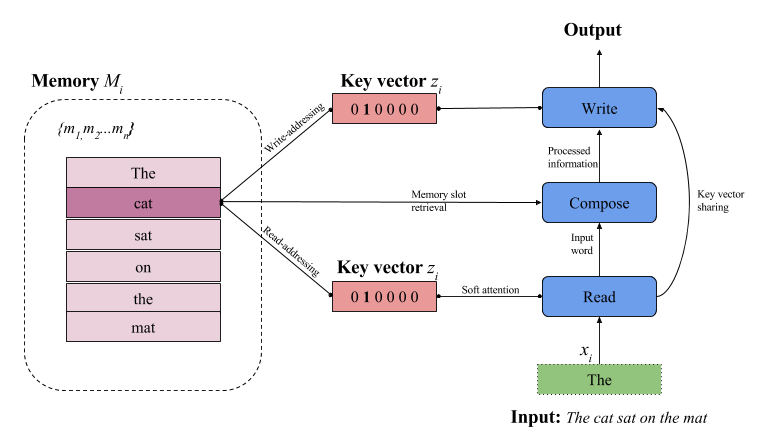

# Neural Semantic Encoders #

This project contains Chainer implementation of [Neural Semantic Encoders](https://arxiv.org/abs/1607.04315), a memory-augmented neural network.
- Paper: [https://arxiv.org/abs/1607.04315](https://arxiv.org/abs/1607.04315)
- Slides (pdf): [www.tsendeemts.com](http://www.tsendeemts.com/assets/NLP_MANNs.pdf)

Prerequisites
-------------

- Python 2.7
- [chainer](http://chainer.org/) (tested on chainer 1.19.0)
- Other data utils: sklearn, pandas, numpy etc.

Usage
-----
To train a NSE model on SNLI dataset:

    $ python snli/train_nse.py --snli path/to/snli_1.0 --glove path/to/glove.840B.300d.txt

To train a shared memory model (MMA-NSE):

    $ python snli/train_nse_mma.py --snli path/to/snli_1.0 --glove path/to/glove.840B.300d.txt

Results
-------
The plain NSE model obtains an accuracy around 84-85% on SNLI test set.

Author
------
Tsendsuren Munkhdalai / [@tsendeemts](http://www.tsendeemts.com/)

Other 3rd party implementations
------
* [Keras NSE implementation by @pdasigi](https://github.com/pdasigi/neural-semantic-encoders)